# ARK-4 e/CFW for the PSP and PS Vita.

New, updated, improved and modern `Custom Firmware` for the `PSP` and `PS Vita`'s `ePSP`.
Simple to use and full of unique features, `ARK CFW` aims at keeping the `PSP` experience fresh. Being a successor to `PRO` and `ME`,
`ARK` is now the most feature-complete `CFW` for the `PSP`, having all features from classic `CFW`
as well as unique and exclusive new features not found anywhere else.

### Table of Contents (Quick Links)
  

 
 
 

<a style="font-size: 18px;" href="https://discord.gg/bePrj9W">Join the PSP Homebrew Community Discord</a>
 
<label style="text-decoration: underline; font-size: 14px;">We are located in the <b>#ark-cfw channel</b></label>
 
 

  * [FEATURES:](#features)

<a style="font-weight: bold; font-size:24px; text-decoration: underline;" href="https://github.com/PSP-Archive/ARK-4/wiki">ARK-4 WIKI</a>

 - [Legacy Game Exploits (PSP & Vita)](#legacy-game-exploits-psp--vita)

  * [CUSTOMIZATION](#customization)
      - [Advanced VSH Menu Options](#advanced-vsh-menu-options)
      - [Installing Plugins](#installing-plugins)
      - [Configuration and Settings](#configuration-and-settings)
      - [Custom Launcher](#custom-launcher)
      - [Custom Themes](#custom-themes)
      - [Other Launchers](#other-launchers)
  * [Other](#other)
      - [History](#history)
      - [Changelog](#changelog)
      - [Credits](#credits)
      - [Warnings](#warnings)

## FEATURES:

- `Core` system heavily updated from traditional CFW with new exclusive features.

- `Inferno 2` Driver compatible with all formats (`ISO`, `CSO`, `ZSO`, `JSO`, `CSOv2` and `DAX`).

- `Popcorn` controller for custom `PS1` games. Compatible with `PopsLoader` V3 and V4i.

- Built-in `No-DRM` engine `Stargate`, fixes many anti-CFW games. Compatible with `npdrm_free` and `nploader`.

- `Plugin` support for `PSP` games, `PS1` games and `VSH` (XMB), including the ability to enable and disable plugins `per-game`.

- `Region Free` playback of `UMD Video` on all PSP models. Change the region of your `UMD` drive on-the-fly.

- Compatible with all `PSP` models on firmwares `6.60` and `6.61`.

- Compatible with all `PS Vita` models on firmware `2.10` up to `3.74`, either official firmware or via `Adrenaline`.

- Compatible with `6.60` `Testing Tool` Firmware and `Testkit` Units.

- Compatible with `6.60` `Development Tool` Firmware and `Devkit` Units.

- Can be fully installed and booted on memory stick in compatible models via `Time Machine`.

- Can be used to unbrick compatible PSP models using `Despertar del Cementerio` in combination with a `Pandora` or `Baryon Sweeper`.

- `Minimalistic`: only 6 files installed on PSP flash, CFW extensions are installed on memory stick.

- Resistant to `soft-bricks`, easy to recover from bad configurations with a new and improved `Recovery` app.

- `Custom game launcher` with built-in game categories, file browser, `FTP` server and client, modernized look and more.

- Fully configurable via the `XMB`.

- Compatible with `PRO Online` and `Xlink Kai`.

- Compatible with Legacy Homebrew via `eLoader` and `Leda`. Compatible with the KXploit format.

- Compatible with `cIPL` and `Infinity 2` bootloaders for permanent CFW.

- `OTA` updates. Fully updateable via the internet.

#### Compiling ARK ( For Developers )

    Build script will allow you to use the correct SDK that ARK was built with.

- Docker container: `docker pull docker.io/krazynez/ark-4:latest`

<b>These are utilized either with cloning the repo or using the Docker container</b>

- Release: `./build.sh` 
- Debug: `./build.sh --debug`
- Manually: install the oldest possible SDK (ideally the one used to compile M33), then run `make`

Use `-h` or `--help` to show all available flags 

#### On PSP

###### Online PSP Installer
For an easy deployment of ARK on a PSP connected to the internet, you can follow this [video](https://www.youtube.com/watch?v=mopy1N57DlI)

#### Legacy Game Exploits (PSP & Vita)

- This is mainly for `developers`.
- Considering the savedata exploit loads `H.BIN` from the savedata path.
- Copy every file from `ARK_01234` except `PARAM.SFO`, `SAVEDATA.BIN` and `K.BIN` (`ICON0.PNG` can also be ignored), into the hacked savedata folder.
- You need to have a `K.BIN` if you are running on an ancient Vita firmware (there's plenty of kernel exploit sources in ARK-2 and ARK-3 for reference).
- Run the game and trigger the exploit as normal, it should load ARK.
- If you have issues with stability, it might be necessary to run `freemem()` algorithm in the kernel exploit file (`K.BIN`).
  

## CUSTOMIZATION

#### Advanced VSH Menu Options

The default VSH menu packaged in `ARK_01234` is a simplified, easier to use version of classic VSH menus.
To have a more classic VSH menu with more advanced features you can select the `Advanced VSH Menu` from within the simplified VSH menu.

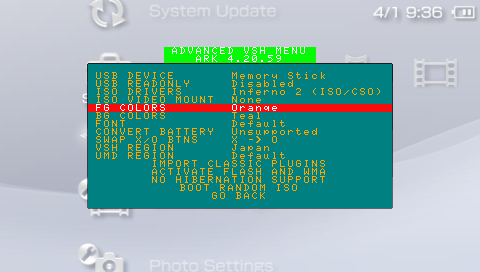

Some of the features available in Advanced VSH Menu include:

- Change USB Device mount (Memory Stick, Flash, UMD).
- Protect Flash in USB Device mount.
- View available ISO drivers.
- Mount UMD Video ISO.
- Change Foreground/Background VSH Menu colors.
- Convert battery from normal to pandora and viceversa.
- Activate flash and WMA playback.
- Swap X/O buttons.
- Delete hibernation (PSP Go paused game).
- Convert classic plugins to the new ARK format.
- Boot Random ISO.

And more.

Installing on PSP Flash:

`WARNING`: for advanced users only, do not attempt this if you're not familiar with the PSP flash.

By default, ARK's VSH Menu is installed on the Memory Stick (in `/PSP/SAVEDATA/ARK_01234/VSHMENU.PRX`).
This has the limitation that you won't be able to access VSH menu without a memory stick.
If you want to permanently install VSH Menu you need to copy `VSHMENU.PRX` to somewhere on your computer and rename it to `ark_satelite.prx`,
which you can then copy to PSP's `flash0:/vsh/module/`, you can use the VSH Menu itself to enable flash0 via USB. The final path should be `flash0:/vsh/module/ark_satelite.prx`.
You can also achieve the same result by using the `Full Installer`.

`NOTE`: even if you install VSH Menu on flash0, the one installed on Memory Stick takes precedence in loading.

#### Configuration and Settings

You can use the XMB and/or the Recovery Menu to easily handle CFW settings. Depending on your region you might have them in `Game` or `Extras` category.
However if you prefer you can also manually handle the settings yourself.

Located in Game Section

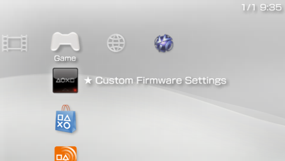

Located in Extras Section

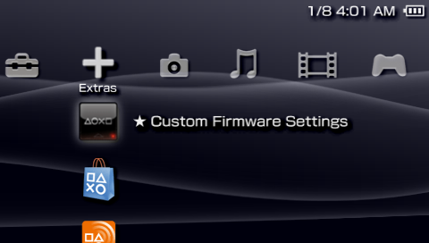

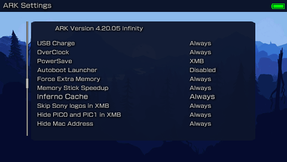

You can create a SETTINGS.TXT file using the same format as PLUGINS.TXT to enable/disable some CFW functionality on different parts of the system.
Configuration settings you can use in ARK include:

- `overclock`: use this for better performance at the expense of battery time. Sets CPU/BUS speed to 333/166.
- `powersave`: use this for better battery life at the expense of performance. Sets CPU/BUS speed to 133/66.
- `usbcharge`: enables USB charging wherever you want.
- `launcher`: replaces the XMB with a custom menu launcher.
- `disablepause`: disables the pause game feature on PSP Go.
- `highmem`: enables high memory on models above 1K.
 You should only use this on homebrew runlevel as retail games were not meant to use the extra memory,
 and this can cause issues with cheat devices or other plugins that expect games to have their data at specific memory addresses.
 - `infernocache`: enables cache for Inferno driver, improving performance of some games.
 - `oldplugin`: enables old plugins support on PSP Go (redirects `ms0` to `ef0`).
 - `skiplogos`: skips the coldboot and gameboot logos.

You can use the same runlevels as used in plugins to tell ARK when the settings take effect (all/always, umd, homebrew, game, pops, vsh).

For example, you can overclock to highest CPU speed like this:
- always, overclock, on

Another example, overclock only on games, use powersaving on VSH:
- game, overclock, on
- vsh, powersave, on

This also allows you to enable settings on specific games:
  - ULUS01234, overclock, on
  - ULES01234, powersave, on
  

#### Custom Launcher
  
ARK comes prepacked with a very powerful launcher with a built-in file browser and highly customizable.

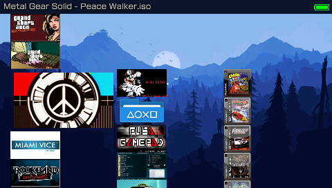

Some of its features include:
  
  - Playback of ISO and all CSO formats with PMF video preview.
  
  - Playback of UMD game discs.
  
  - Categorized and organized game menu by PSP Games, PSP Homebrew and PS1 Games.
  
  - Ability to scan savedata folders for games.
  
  - Compatibility with old VHBL, ARK-2 and TN-CEF file names and folder paths.
  
  - Ability to copy, move or delete entire folders.
  
  - File browser has built-in FTP client, allowing you to browse and copy files from another PSP.
  
  - FTP server and client can run simultaneously.
  
  - Ability to mount UMD Video ISOs using the file browser.

  - Ability to extract .zip files (up to highest compression) and .rar files (standard compression).
  
  - Ability to edit text files (.txt, .cfg or .ini).
  
  - Ability to install Plugins via the file browser.
  
  - Different background animation effects.
  
  - And more.

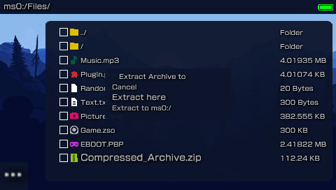

  
You can however change it to whatever you please. You can change the theme used by both the custom launcher and recovery menu by replacing THEME.ARK with your own.

###### Custom Themes
You can install themes within Custom Launcher (and Recovery Menu). Just place the `themes` folder anywhere on your PSP and use the file browser in the Custom Launcher to select which theme (`THEME.ARK`) you would like to install. By selecting it a submenu will pop up asking to install it or to preview the theme without installing.

<i>Orbs are animations and not part of the actual Themes </i>

Theme: ARK_Revamped

Theme: Red 

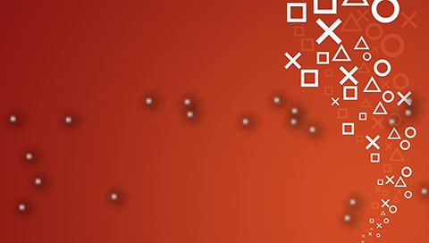

Theme: Ubuntu 

Theme: Peace Walker 

Theme: Matrix

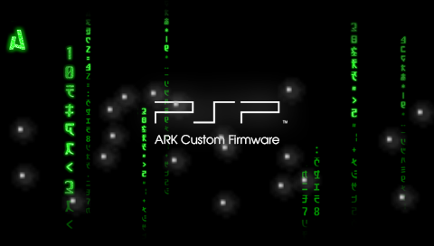

Theme: Material Dark

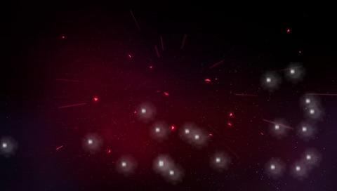

Theme: GX Classic

Theme: Jurassic Park

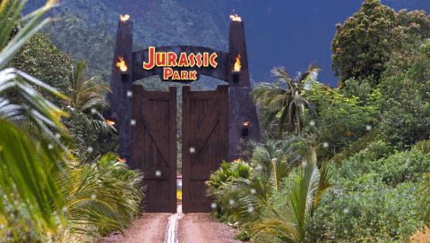

Theme: Classic

Theme: Blue 2

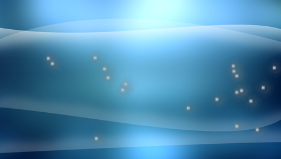

Theme: Blue

Theme: Black

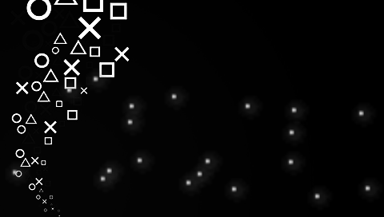

Theme: BadgerOS_Sprunk

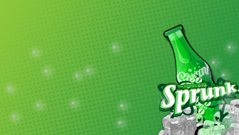

Theme: BadgerOS

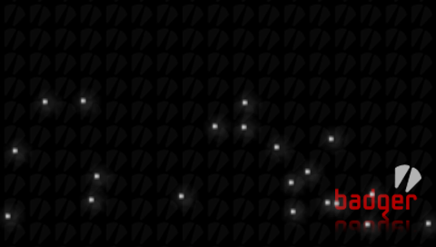

Theme: CyanogenPSP

Theme: Windows 7

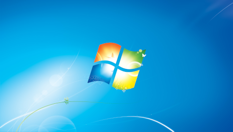

Theme: Windows XP

Theme: Yokai

###### Other Launchers

Aside from the default launcher provided, there have been many  other custom launchers created by scene members, some better looking, some with more features, some more simpler, but all of them with personality, dedication and love from the community.

Here is a list of all popular menus for ARK:

- ONEMenu by gdljjrod: https://github.com/ONElua/ONEmenu/releases

- vMenu by neur0n: http://www.mediafire.com/file/7acb5mhawx4gr9t/vMenu_ARK.7z/file

- yMenu by wth/yosh: https://docs.google.com/uc?export=download&id=0B0kWUCdtGmJwLUhRUlNJSWhMWVE

- gMenu by gbot: http://www.mediafire.com/file/oou5490qc99vr7d/gmenuARK.rar/file

- 138Menu by gbot: https://wololo.net/talk/viewtopic.php?f=53&t=33511

- pyMenu by Acid_Snake: https://wololo.net/talk/viewtopic.php?t=21942

You can find a collection here: https://github.com/PSP-Archive/ARK-Launchers

Note: some of these menus have not been updated or supported by their developers in a while, they may not work well with modern ARK or real PSP hardware.

## Other

#### History
Despite being a relatively new `Custom Firmware` for the `PSP`, `ARK` has quite a history that goes back to the early days of the `PS Vita` scene.

`ARK` is a `CFW` that started as a port (more like rewrite) of `PRO CFW` to the `PS Vita` (named `PROVITA`) created by the original `Team PRO` members (`Coldbird`, `Liquid Snake` and `Neur0n`).
After the original team left, the source code of `PROVITA` was handed over to me (`Acid_Snake`) and my long time scene friend `qwikrazor87`.

We quickly began a huge process of rewriting and restructuring code, more specifically a much more robust dynamic patching algorithms that would work on any 6.6X based firmware (including all Vita's ePSP firmwares). Thus `ARK-2` was born.

Soon after, qwik, thefl0w and I began working on `PSX exploits`, which resulted in `TN-X` and `ARK-3` (never publicly released).

Because the original `PRO CFW` hasn't been updated or maintained in a while, and it has become a little bloated and hard to work with, I decided to start working on porting `ARK` to the `PSP` since the core elements of the `CFW` are compatible with `PSP` `6.60` and `6.61` with minor changes.

After lots of work getting the same `ARK` binaries to properly work on both PSP and Vita, I am proud to announce that the release of `ARK-4` is finally here!

#### Changelog

- `ARK-1`: original port/rewrite of `PRO CFW` for the `PS Vita`. Codenamed `PROVITA`. Source code can be found here: https://github.com/PSP-Archive/ARK-1-PROVita-
- `ARK-2`: dynamic patching allows it to work with most of `PS Vita` firmwares. Source code can be found here: https://github.com/PSP-Archive/ARK-2
- `ARK-3`: device-specific runtime allows `ARK` to run in multiple scenarios (`ePSP` and `ePSX`). Source code can be found here: https://github.com/PSP-Archive/ARK-3
- `ARK-4`: ported to the original `PSP`. Huge amounts of improvements and fixes over previous versions.

`Note`: this is a simplified `changelog`, for a full version you can visit here: https://github.com/PSP-Archive/ARK-4/blob/main/CHANGELOG.md

#### Credits

- `Team PRO` (the original developers of ARK): `Coldbird`, `hrimfaxi` (aka. `Liquid Snake`) and `Neur0n`.

- `The Ancient Gods of the PSP Scene`: mathieulth, davee, Proxima, zecoxao, among other tinkerers.

- `qwikrazor87` for being such a genius and all his hard work with kernel exploits and ARK-2.
  
- `TheFl0w` (aka. `Total_Noob`) for his advancements and research in CFW development and overall contributions to the scene.

- `meetpatty` for his excellent work in fixing bugs and adding important features like cIPL and DevKit support as well as porting `Time Machine` and `Despertar del Cementerio`.

- `SilicaAndPina` for unlocking the full potential of the PS Vita's Official PSP emulator with such great tools like `ChovySign`, `NoPspEmuDrm` and `ps1cfw_enabler`.

- `Codestation` for his incredible work improving CSO speeds and creating the ZSO format.

- `Krazynez` for his amazing work on `Advanced VSH Menu` and other bugfixes and features.

- `pyroesp` for his excellent work improving `VSH Menu` and refactoring code.

- `TheSubPlayer` for all the wonderful themes made for the custom launcher.

- `UnkownBrackets` (maxcso) for his help understanding the DAX format and Inferno speed hacks as well as creating the CSOv2 format.

- `Zer01ne`, `noname120`, `astart` and other devs that have blessed me with their knowledge and wisdom.

- `Zecoxao` for his great work creating dumpers that would allow us to archive rare firmwares.

- `balika` for his research in porting M33 to modern firmware that has helped improve compatibility in ARK.

- `hrydgard` for the PMF player as well as being an inspiration for the custom launcher.

- Every other giant shoulder I am standing on.

#### Warnings

- ARK comes with no warranty whatsoever. It was designed to be noob-proof, however it is possible for the universe to create an even greater noob capable of using ARK to destroy the Earth (or his PSP). I cannot be held responsible for this.

- ARK may cause ejectile malfunction if your hard drive is not hard enough.

- If this software malfunctions, you can turn it off and on again.

