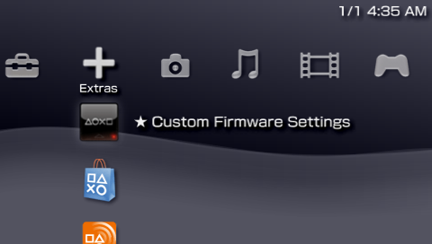

# ARK-4 e/CFW for the PSP and PS Vita.

New, updated, improved and modern `Custom Firmware` for the `PSP` and `PS Vita`'s `ePSP`.
Simple to use and full of unique features, `ARK CFW` aims at keeping the `PSP` experience fresh. Being a successor to `PRO` and `ME`,
`ARK` is now the most feature-complete `CFW` for the `PSP`, having all features from classic `CFW`
as well as unique and exclusive new features not found anywhere else.

### More Information in WIKI
<a style="font-weight: bold; font-size:32px; text-decoration: underline;" href="https://github.com/PSP-Archive/ARK-4/wiki">ARK-4 WIKI</a>
 

### Table of Contents (Quick Links)
  * [FEATURES:](#features)
  * [Installation on PSP](#installation-on-psp)
  * [Installation on PS Vita](#installation-on-ps-vita)
  * [Changelog](#changelog)
  * [Warnings](#warnings)

## FEATURES:

- Compatible with every `PSP` model (including testkits and devkits) and every `PS Vita` model.

- Support for `homebrew` and `plugins`, compatible with legacy 1.50 software.

- Heavily optimized `Inferno 2` ISO Driver.

- Custom `PS1` games supported via the `Popcorn` Controller.

- Built-in game fixes using the anti-CFW engine `Stargate`.

- `New cIPL` compatible with all PSP models, for a true permanent CFW with enhanced brick protection.

- Includes `Despertar del Cementerio Version 10`, allowing to unbrick any PSP.

- `Custom game launcher` useful when the XMB isn't available or lacks a certain feature.
 
- `OTA` updates. Fully updateable via the internet.

#### Installation On PSP

##### Installation from Custom Firmware
- If 6.61 PRO or ME is already installed.
- For any earlier CFW, update to latest 6.61 firmware and use instructions below for Official Firmware.
- Install DC-ARK (see bellow).
- Install New cIPL (see bellow).
- PowerOff console and power it back on while holding L button.
- Use DC to do a fresh and full install of 6.61 ARK.

##### Installation from Official Firmware
- If no custom firmware is installed (PSP is original).
- Copy `ARK_01234` folder into `/PSP/SAVEDATA/` folder.
- Copy `ARK_Loader` folder into `/PSP/GAME/` folder.
- Launch `ARK Loader`. It will install ARK modules on PSP Flash and boot the CFW.
- At this point `ARK` will work as a `Live CFW`, meaning that `ARK Loader` will need to be run every time the console is turned off or rebooted.
- To convert `ARK` into a `Permanent CFW` you can use `cIPL`.

##### Permanent CFW via cIPL

- Works on all PSP models, including testkits and devkits.
- Installer will choose the correct version according to your model.
- Some models can install either the Classic cIPL or the New cIPL.
- Copy `ARK_cIPL` folder to `/PSP/GAME/` and run the program.
- Press the corresponding button in the installation page to install or remove the cIPL patch.

##### Full Flash and Classic Installations

- This only make sense when combined with a permanent intallation (cIPL). It doesn't make sense on PSP Go with a healthy Internal Memory.
- This allows you to install and use all of ARK's features on the console's internal flash memory, except for Custom Launcher and translations.
- Copy `ARK_Full_Installer` to `/PSP/GAME/` and run it from `ARK`. It will install some extra files into the console's flash.
- If the `Custom Launcher` is not available (i.e. you delete the ARK savedata or remove the memory card), `PRO Shell` will take its place.
- When no savedata folder is available the default ARK path used to store settings will be `ms0:/SEPLUGINS/`.
- Even if files are stored in the console's flash memory, the ones in the savedata folder will still take priority in loading.
- If at this point you get rid of ARK's savedata then you will have a Classic Installation (ARK will behave much like your Classic CFW such as PRO or ME).

##### Time Machine and Despertar del Cementerio

- `Time Machine` allows the ability to boot the `6.61` firmware and `ARK` entirely from the Memory Stick.
- `Despertar del Cementerio` allows the ability to revive a bricked PSP when used in combination with a `Pandora` or `Baryon Sweeper`.
- You can install `DC-ARK` either using a `PSP` or a `PC` (Windows, Mac and Linux).
- On `PSP` you need to be running a `CFW` to install `DC-ARK` (ARK itself or any other).
- Copy the `ARK_DC` folder to the `/PSP/GAME/` folder and run the installer from the `XMB`.
- Copy the 6.61 Official Firmware Update by Sony renamed to `661.PBP` at the root of the memory stick.
- Follow the instructions to install DC-ARK and create a magic memory stick.
- On `PC`, you need `Python 3` and run `MagicMemoryCreator` with `admin`/`root` privileges.
- You can use New cIPL to boot into DC-ARK by holding L-trigger when powering on.
- Or use a `Pandora` or `Baryon Sweeper` in combination with your newly created `Magic Memory Stick` to boot up `Despertar del Cementerio`.
- On compatible models, you can use `Advanced VSH Menu` to create a `Pandora Battery`.
- From here you can either boot ARK from memory stick, install 6.61 Firmware with ARK on the NAND or install 6.61 Official Firmware.

#### Installation On PS Vita

There are two types of installation types on PS Vita. You can use either one or both.
 Stanalone works on top of the original unmodified pspemu.
 You an also run ARK within Adrenaline to achieve a Hybrid CFW.

##### Standalone (Official PSPEmu)

- Works on Firmware 3.60 up to 3.74, requires Henkaku/h-encore or any native hack.
- Download and install <a href="https://github.com/LiEnby/NoPspEmuDrm/releases">NoPspEmuDrm</a> (you can use `AutoPlugin`).
- Copy `FasterARK.vpk` from `PSVita/` folder anywhere on your vita and install using `VitaShell`. 
- Launch `FasterARK` and wait for the install process to finish.
- Both `ARK` and `ARK-X` bubbles will appear in `Live Area`.
- Use the `ARK` bubble for `PSP` games and homebrew. It can play `PS1` but with limitations related to sound playback.
- Use the `ARK-X` bubble for `PS1` games without any sound limitations.
- Once `ARK` bubbles are installed, you can delete `FasterARK`.
- To `exit` from a game or homebrew back to the `custom launcher`, press `L+R+Down+Start` (on `ARK-X` use `L2+R2+Down+Start` or `L1+R1+Start+Down` for `VitaTV`).
- NOTE: Some features are not available in standalone installations, mainly the official Sony `XMB`, and `Force Extra RAM` setting is known to be unstable.
- NOTE: If you want to have an `ARK` bubble that works on `Official Firmware` you must use `ChovySign` with a valid license. Instructions in Wiki.

##### Adrenaline (Patched PSPEmu)

- Works on Firmware 3.60 up to 3.74, requires Henkaku/h-encore and <a href="https://github.com/isage/Adrenaline">Adrenaline</a> (Isage's fork is recommended, but original will work too).
- (Skip this step if `Standalone` is already installed) Install `ARK_01234` folder into `/PSP/SAVEDATA/` folder.
- Install `ARK_Loader` folder into `/PSP/GAME/` folder.
- Use `Adrenaline Bubbles Manager` to create an autoboot bubble for `ARK Loader`: https://github.com/ONElua/AdrenalineBubbleManager/releases
- Note: this does not permanently modify `Adrenaline` in any way.

#### Updating ARK

##### There are three ways to update ARK:

- Option 1: Use the `System Update` ( `ARK-4 Updater` ) feature in the XMB. Requires your PSP/Vita to be connected to the internet.
- Option 2: Copy the `UPDATE` folder to `/PSP/GAME/` and run it.
- Option 3: Copy `ARK_01234` folder and (on PSP) run `ARK Loader` again to install new flash0 files.

#### Changelog

- `ARK-1`: original port/rewrite of `PRO CFW` for the `PS Vita`. Codenamed `PROVITA`. Source code can be found here: https://github.com/PSP-Archive/ARK-1-PROVita-
- `ARK-2`: dynamic patching allows it to work with most of `PS Vita` firmwares. Source code can be found here: https://github.com/PSP-Archive/ARK-2
- `ARK-3`: device-specific runtime allows `ARK` to run in multiple scenarios (`ePSP` and `ePSX`). Source code can be found here: https://github.com/PSP-Archive/ARK-3
- `ARK-4`: ported to the original `PSP`. Huge amounts of improvements and fixes over previous versions.

`Note`: this is a simplified `changelog`, for a full version you can visit here: https://github.com/PSP-Archive/ARK-4/blob/main/CHANGELOG.md

#### Warnings

- ARK comes with no warranty whatsoever. It was designed to be noob-proof, however it is possible for the universe to create an even greater noob capable of using ARK to destroy the Earth (or his PSP). I cannot be held responsible for this.

- ARK may cause ejectile malfunction if your hard drive is not hard enough.

- If this software malfunctions, you can turn it off and on again.

- You may be shunned for not reading the Wiki. 

