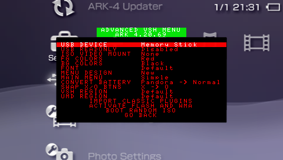

# ARK-4 e/CFW for the PSP and PS Vita.

New, updated, improved and modern `Custom Firmware` for the `PSP` and `PS Vita`'s `ePSP`.
Simple to use and full of unique features, `ARK CFW` aims at keeping the `PSP` experience fresh. Being a successor to `PRO` and `ME`,
`ARK` is now the most feature-complete `CFW` for the `PSP`, having all features from classic `CFW`
as well as unique and exclusive new features not found anywhere else.

 

<a style="font-size: 18px;" href="https://discord.gg/bePrj9W">Join the PSP Homebrew Community Discord</a>
 
<label style="text-decoration: underline; font-size: 14px;">We are located in the <b>#ark-cfw channel</b></label>
 
 
 

### Installation Guide located in WIKI
<a style="font-weight: bold; font-size:32px; text-decoration: underline;" href="https://github.com/PSP-Archive/ARK-4/wiki">ARK-4 WIKI</a>
 
 
 

### Table of Contents (Quick Links)
  * [FEATURES:](#features)
  * [Installation on PSP](#Installation-on-PSP)
  * [Installation on PS Vita](#installation-on-ps-vita)
  * [Changelog](#changelog)
  * [Warnings](#warnings)

## FEATURES:

- `Core` system for unsigned code execution heavily updated from traditional CFW with robust patching algorithms and improved API.

- Heavily optimized `Inferno 2` Driver compatible with all known PSP formats (ISO, CSO, ZSO, JSO, CSOv2 and DAX).

- `Popcorn` controller for custom PS1 games with support for external configuration files and anti-libcrypt protection.

- Built-in No-DRM engine `Stargate`, fixes many anti-CFW games. Expandible via other NoDRM plugins.

- `Plugin` support for PSP games and homebrew, PS1 games and VSH (XMB), including the ability to enable and disable plugins per-game.

- `Region Free` playback of UMD Video on all PSP models. Change the region of your UMD drive on-the-fly.

- Compatible with all `PSP` models on firmwares `6.60` and `6.61`.

- Compatible with all `PS Vita` models on firmware `2.10` up to `3.74` OFW or Henkaku, including support for the `Adrenaline` pspemu mod.

- Compatible with `6.60 Testing Tool` and `6.60 Development Tool` firmwares for testkit and devkit units (inlcuding `CEX2DEX` converted units).

- Updated `cIPL` compatible with all PSP models, including toolkits, for truely permanent CFW.

- Can be fully installed and booted on memory stick via `Time Machine`.

- Can be used to unbrick any PSP model using `Despertar del Cementerio Version 10` in combination with a `Pandora Battery` or `Baryon Sweeper`.

- Resistant to `bricks`, easy to recover from bad configurations, various recovery methods including being able to load `DC` via `cIPL` without any special device.

- `Custom game launcher` with built-in game categories, file browser, FTP server and client, modernized look and more.

- Built-in extensions allow the CFW to be managed entirely via the `XMB`.

- Compatible with `PRO Online` and `Xlink Kai`.

- Compatible with `Legacy Homebrew` via eLoader, Leda Plugin or the 1.50 Kernel Addon, including the classic KXploit naming format.

- `OTA` updates. Fully updateable via the internet.

#### Compiling ARK ( For Developers )

    Build script will allow you to use the correct SDK that ARK was built with.

- Docker container: `docker pull docker.io/krazynez/ark-4:latest`

<b>These are utilized either with cloning the repo or using the Docker container</b>

- Release: `./build.sh` 
- Debug: `./build.sh --debug`
- Manually: install the oldest possible SDK (ideally the one used to compile M33), then run `make`

Use `-h` or `--help` to show all available flags 

#### Installation On PSP

##### The instructions are as follows:
  
- Move or copy `ARK_01234` folder into `/PSP/SAVEDATA/` folder.
- Move or copy `ARK_Loader` folder into `/PSP/GAME/` folder.
- Launch `ARK Loader`. It will install ARK modules on PSP Flash and boot the CFW.
- At this point `ARK` will work as a `Live CFW`, meaning that `ARK Loader` will need to be run every time the console is turned off or rebooted.
- To convert `ARK` into a `Permanent CFW` you can use either `cIPL` or `Infinity`, along with the `Full Installer` for a complete permanent experience.

##### Permanent CFW via cIPL

- `New cIPL`: works with every retail model (1K, 2K, 3K, Go and Street) on firmware `6.61`.
- `Classic cIPL`: works with `1g` and early `2g` on firmware `6.60` or `6.61` as well as `Testkits` on `6.60 Testing Tool`.
- `DevTool cKBOOTI`: works with `DTP-T1000` (devkits) on `6.60 Development Tool`.
- Installer will choose the correct version according to your model.
- Move or copy `ARK_cIPL` folder to `/PSP/GAME/` and run the program.
- Press the corresponding button in the installation page to install or remove the cIPL patch.

##### Full Flash Installation

- This allows you to install and use all of ARK's features on the console's internal flash memory, allowing you to entirely remove the `ARK_01234` savedata folder or memory stick.
- Copy `ARK_Full_Installer` to `/PSP/GAME/` and run it from `ARK`. It will install some extra files into the console's flash.
- If the `Custom Launcher` is not available (i.e. you delete the ARK savedata or remove the memory card), `PRO Shell` will take its place.
- When no savedata folder is available the default ARK path used to store settings will be `ms0:/SEPLUGINS/`.
- Even if files are stored in the console's flash memory, the ones in the savedata folder will still take priority in loading.

##### Time Machine and Despertar del Cementerio

- `Time Machine` allows the ability to boot the `6.61` firmware and `ARK` entirely from the Memory Stick.
- `Despertar del Cementerio` allows the ability to revive a bricked PSP when used in combination with a `Pandora` or `Baryon Sweeper`.
- To install `DC-ARK` you must first format the memory stick leaving enough space for the boot sector. You can use `PSP Tool` to do this.
- You can install `DC-ARK` either using a `PSP` or a `PC` (Windows, Mac and Linux).
- On `PSP` you need to be running a `CFW` to install `DC-ARK` (ARK itself or any other).
- Copy the `ARK_DC` folder to the `/PSP/GAME/` folder and run the installer from the `XMB`.
- Follow the instructions to install DC-ARK and create a magic memory stick.
- On `PC`, you need `Python 3` and run `MagicMemoryCreator` with `admin`/`root` priviledges.
- On compatible models, you can use `Advanced VSH Menu` to create a `Pandora Battery`.
- Use a `Pandora` or `Baryon Sweeper` in combination with your newly created `Magic Memory Stick` to boot up `Despertar del Cementerio`.
- From here you can either boot ARK from memory stick, install 6.61 Firmware with ARK on the Nand or install 6.61 Official Firmware

#### Installation On PS Vita

##### Standalone (Official PSPEmu)

- Works on Firmware 3.60 up to 3.74, requires Henkaku/h-encore or any native hack.
- Download and install <a href="https://github.com/LiEnby/NoPspEmuDrm/releases">NoPspEmuDrm</a> (you can use `AutoPlugin`).
- Copy `FasterARK.vpk` from `PSVita/` folder anywhere on your vita and install using `VitaShell`. 
- Open `FasterARK` and wait for the install process to finish.
- Both `ARK` and `ARK-X` bubbles will appear in `Live Area`.
- Use the `ARK` bubble for `PSP` games and homebrew. It can play `PS1` but with limitations related to sound playback.
- Use the `ARK-X` bubble for `PS1` games without any sound limitations.
- Once `ARK` bubbles are installed, you can delete `FasterARK`.
- To `exit` from a game or homebrew back to the `custom launcher`, press `L+R+Down+Start` (on `ARK-X` use `L2+R2+Down+Start` or `L1+R1+Start+Down` for `VitaTV`).
- NOTE: Some features are not available in standalone installations, mainly the official Sony `XMB` and `Force Extra RAM` setting (needed for `PRO Online`).
- NOTE: If you want to have an `ARK` bubble that works on `Official Firmware` you must use `ChovySign` with a valid license. Instructions in Wiki.

##### Adrenaline (Patched PSPEmu)

- Works on Firmware 3.60 up to 3.74, requires Henkaku/h-encore and `Adrenaline` (https://github.com/TheOfficialFloW/Adrenaline).
- (Skip this step if `Standalone` is already installed) Install `ARK_01234` folder into `/PSP/SAVEDATA/` folder.
- Install `ARK_Loader` folder into `/PSP/GAME/` folder.
- Use `Adrenaline Bubbles Manager` to create an autoboot bubble for `ARK Loader`: https://github.com/ONElua/AdrenalineBubbleManager/releases
- Note: this does not permanently modify `Adrenaline` in any way.

#### Updating ARK

##### There are three ways to update ARK:

- Option 1: Use the `System Update` feature in the XMB. Requires your PSP/Vita to be connected to the internet.
- Option 2: Copy the `UPDATE` folder to `/PSP/GAME/` and run it.
- Option 3: Copy `ARK_01234` folder and (on PSP) run `ARK Loader` again to install new flash0 files.

#### Changelog

- `ARK-1`: original port/rewrite of `PRO CFW` for the `PS Vita`. Codenamed `PROVITA`. Source code can be found here: https://github.com/PSP-Archive/ARK-1-PROVita-
- `ARK-2`: dynamic patching allows it to work with most of `PS Vita` firmwares. Source code can be found here: https://github.com/PSP-Archive/ARK-2
- `ARK-3`: device-specific runtime allows `ARK` to run in multiple scenarios (`ePSP` and `ePSX`). Source code can be found here: https://github.com/PSP-Archive/ARK-3
- `ARK-4`: ported to the original `PSP`. Huge amounts of improvements and fixes over previous versions.

`Note`: this is a simplified `changelog`, for a full version you can visit here: https://github.com/PSP-Archive/ARK-4/blob/main/CHANGELOG.md

#### Warnings

- ARK comes with no warranty whatsoever. It was designed to be noob-proof, however it is possible for the universe to create an even greater noob capable of using ARK to destroy the Earth (or his PSP). I cannot be held responsible for this.

- ARK may cause ejectile malfunction if your hard drive is not hard enough.

- If this software malfunctions, you can turn it off and on again.

